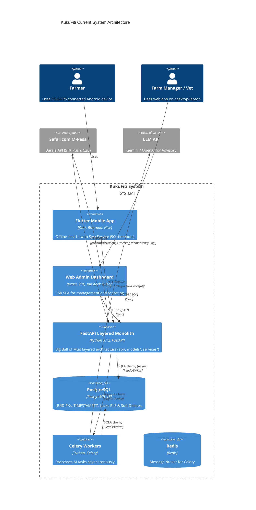

# KukuFiti Architectural Audit & Migration Plan

## SECTION A — CURRENT ARCHITECTURE SNAPSHOT



> [!WARNING]
> **Missing Arrows & Components**: 
> 1. No **DomainEventBus** exists within the FastAPI layer (modules are tightly coupled by direct imports).
> 2. No **Push Notification (FCM) Service** is configured for critical farm alerts (disease risk, batch harvest threshold).
> 3. No **PgBouncer** connection pooler is present between FastAPI/Celery and PostgreSQL (critical risk at 10,000+ scale).

---

## SECTION B — MASTER SCORE DASHBOARD

| Layer | Score | Primary finding |
|-------|-------|-----------------|
| L1 — Flutter mobile | 6/10 | SyncService implements outbox pattern via Hive, but uses blocking 90s connection timeouts and lacks WorkManager for background sync. |
| L2 — Web frontend | 5/10 | Pure CSR SPA with React Query. Relies on offset-based pagination from the API which will cause database collapse at 10,000+ records. |
| L3 — Backend module boundaries | 4/10 | Layered "Big Ball of Mud" structure (`app/models/`, `app/api/`). Tightly coupled with direct imports; lacks Domain Events. |
| L4 — M-Pesa financial integrity | 3/10 | Handler verifies STK status securely, but lacks a strict idempotent `mpesa_transactions` log before mutating business entities. |
| L5 — AI-native data | 4/10 | Missing RLS for tenant isolation. Mortality events use free-text instead of standardized Enums/FKs. No AI Context store. |
| L6 — Database health | 7/10 | Good use of UUIDs and TIMESTAMPTZ, but completely lacks soft deletes (`deleted_at`), permanently destroying AI training data on delete. |
| L7 — Infrastructure | 6/10 | Celery workers exist for AI, but missing PgBouncer, and missing structured audit logging middleware. |
| **OVERALL SYSTEM FRAGILITY** | **5/10** | **System is currently functional for hundreds of users but will structurally buckle under the weight of 10,000 concurrent farmers due to lack of connection pooling, hard boundaries, and idempotent financial logs.** |

---

## SECTION C — PRIORITISED REFACTOR BACKLOG

### 1. [L4-001] Implement Strict M-Pesa Idempotency Log
* **WHAT**: Create an `mpesa_transactions` table and insert into it *before* running `_handle_callback_entity` in `mpesa.py`.
* **WHY**: Safaricom can fire duplicate callbacks. Without a unique constraint on `CheckoutRequestID` in a raw log table, race conditions could activate subscriptions twice or miscredit accounts.
* **EFFORT**: 4 hours
* **WHEN**: NOW (pre-launch blocker)
* **BLOCKS**: Reliable Billing & Financial Trust.

### 2. [L6-001] Implement Row Level Security (RLS) & Soft Deletes
* **WHAT**: Update `Base` to include `deleted_at` (soft delete) and implement Postgres RLS policies based on `farm_id` / `tenant_id`.
* **WHY**: Application-level SQLAlchemy filtering is prone to human error. A single missing `.filter(farm_id=...)` leaks financial data across farms. Hard deletes destroy historical training data for the LLM.
* **EFFORT**: 16 hours
* **WHEN**: NOW (pre-launch blocker)
* **BLOCKS**: Multi-tenant AI models, Legal Compliance.

### 3. [L1-001] Optimize Mobile Network Layer for 3G
* **WHAT**: Reduce Dio `connectTimeout` to 8s and `receiveTimeout` to 15s in `api_client.dart`. Implement WorkManager for background execution of `SyncService`.
* **WHY**: A 90s receive timeout on a Meru 3G connection causes the app to hang indefinitely instead of gracefully failing over to the offline queue.
* **EFFORT**: 8 hours
* **WHEN**: 30 DAYS
* **BLOCKS**: Usability in rural connectivity zones.

### 4. [L3-001] Extract Modular Monolith Boundaries & EventBus
* **WHAT**: Refactor `app/` from layered (`models/`, `api/`, `services/`) to vertical slices (`modules/flocks/`, `modules/finance/`). Introduce a central `DomainEventBus`.
* **WHY**: Prevents spaghetti code. Allows the AI module to listen to `MortalityLoggedEvent` without the Flocks module explicitly calling the AI service.
* **EFFORT**: 40+ hours
* **WHEN**: 90 DAYS
* **BLOCKS**: Scaling team velocity, Event-driven AI Advisory.

### 5. [L5-001] Standardize AI Data Inputs
* **WHAT**: Convert `cause` and `symptoms` in `MortalityEvent` from `Text` to strictly validated `Enum` or Foreign Keys mapping to a `diseases` reference table.
* **WHY**: Free text ("cobb 500 died", "Heat", "hot") is impossible to group and train ML models on reliably.
* **EFFORT**: 12 hours
* **WHEN**: 30 DAYS
* **BLOCKS**: Predictive AI (Disease Risk, Harvest Prediction).

---

## SECTION D — MODULAR MONOLITH MIGRATION ROADMAP

### Phase 0 — Harden (0–4 weeks)
**Focus:** Stop the bleeding. Protect the data and the money.
1. **M-Pesa Idempotency:** Deploy `mpesa_transactions` log and wrap callback handling in strict atomic transactions.
2. **Data Security:** Implement Postgres Row Level Security (RLS) for tenant isolation.
3. **Database Health:** Add `deleted_at` to `TimestampMixin` and audit high-cardinality indexes (add missing indexes on `event_date`, `flock_id`).
* **Definition of Done:** Financial callbacks are 100% idempotent, users cannot query other farms' data even if SQLAlchemy filters are omitted, and deleted data remains queryable for AI.

### Phase 1 — Refactor (4–12 weeks)
**Focus:** Codebase restructuring to true Modular Monolith.
1. **Vertical Slicing:** Move all files from `app/models/`, `app/schemas/`, and `app/services/` into domain-specific folders (`app/modules/flocks/`, etc.).
2. **Event Bus Implementation:** Build a fast, in-memory `DomainEventBus` (using FastAPI background tasks or asyncio queues internally) to decouple modules.
3. **API Pagination:** Replace all offset-based `skip/limit` pagination with cursor-based pagination to support scale.
* **Definition of Done:** No direct imports exist between different module `services.py` or `models.py`. All cross-module communication happens via Events.

### Phase 2 — AI Data Pipeline (12–20 weeks)
**Focus:** Structuring the data for the LLM.
1. **Enforce Granularity:** Refactor `MortalityEvent` and `DailyCheck` to eliminate free-text fields in favor of strict enums/reference tables.
2. **Sentinel Events:** Implement a Celery cron job that inserts `MISSED_CHECK` sentinel events at 18:00 EAT for flocks without daily logs.
3. **AI Context Store:** Create `flock_ai_context` table to track LLM recommendations, confidence scores, and farmer acknowledgment.
* **Definition of Done:** 100% of farm data is machine-readable without NLP pre-processing.

### Phase 3 — AI-Native Features (20–36 weeks)
**Focus:** Delivering intelligent value.
1. **Live Disease Risk:** EventBus listener triggers Celery LLM task upon specific mortality patterns.
2. **FCR Insights:** Real-time Feed Conversion Ratio calculation leveraging the granular feed and weight events.
3. **Harvest Prediction:** LLM models forecast optimal harvest dates based on historical growth curves.
* **Definition of Done:** AI insights are pushed to farmers proactively via push notifications (FCM), rather than requiring manual chat queries.

### Phase 4 — Scale Layer (36+ weeks)
**Focus:** Infrastructure for 10,000+ concurrent farmers.
1. **Connection Pooling:** Deploy PgBouncer between FastAPI/Celery and PostgreSQL.
2. **Caching:** Implement Redis caching layer for read-heavy API endpoints (e.g., global reference tables, dashboard aggregates).
3. **Background Sync:** Roll out `WorkManager` in the Flutter app for true background offline-sync capabilities.
* **Definition of Done:** System maintains < 200ms p95 latency under simulated load of 10,000 concurrent active connections.

---

## SECTION E — ONE DECISION TO MAKE THIS WEEK

**The Single Most Dangerous Gap:**
The M-Pesa callback handler (`app/api/v1/routers/billing/mpesa.py`) processes payments by directly mutating the `Subscription`, `Sale`, or `Expenditure` tables without first securing an idempotent lock via a raw transaction log. 

**Real-World Impact (14 days):**
If a Safaricom network hiccup causes them to retry a successful STK Push callback, and the first callback is still processing (or if the database transaction wasn't isolated properly), the system could credit a user twice, or throw a 500 error that leaves the payment in limbo. The farmer pays, but the app doesn't reflect it. Farmer trust in Kenya evaporates instantly when money is "lost" in the cloud.

**Exact Code Change Required:**

1. Create a new SQLAlchemy model:
```python
# app/models/finance.py (or billing)
class MpesaTransaction(Base):
    __tablename__ = "mpesa_transactions"
    checkout_request_id = Column(String, primary_key=True, index=True)
    merchant_request_id = Column(String, nullable=False)
    result_code = Column(Integer, nullable=False)
    raw_payload = Column(JSONB, nullable=False)
```

2. Update the handler in `app/api/v1/routers/billing/mpesa.py`:
```python
from sqlalchemy.dialects.postgresql import insert

@router.post("/callback", response_model=MpesaCallbackResponse)
async def mpesa_callback(request: Request, db: AsyncSession = Depends(get_db)):
    data = await request.json()
    checkout_request_id = data.get("Body", {}).get("stkCallback", {}).get("CheckoutRequestID")
    
    # 1. IMMEDIATE IDEMPOTENT INSERT
    stmt = insert(MpesaTransaction).values(
        checkout_request_id=checkout_request_id,
        merchant_request_id=data.get("Body", {}).get("stkCallback", {}).get("MerchantRequestID"),
        result_code=data.get("Body", {}).get("stkCallback", {}).get("ResultCode"),
        raw_payload=data
    ).on_conflict_do_nothing()
    
    result = await db.execute(stmt)
    await db.commit()
    
    # If no rows were inserted, it's a duplicate callback we already received.
    if result.rowcount == 0:
        return {"status": "ignored", "reason": "Duplicate callback"}
        
    # 2. Proceed with business logic...
    # (Call _handle_callback_entity here)
```
